# mask RCNN

## 1.数据集转化（labelme2coco）

```
# 命令行执行： python labelme2coco.py --input_dir images --output_dir coco --labels labels.txt
# 输出文件夹必须为空文件夹

import argparse
import collections
import datetime
import glob
import json
import os
import os.path as osp
import sys
import uuid
import imgviz
import numpy as np
import labelme
from sklearn.model_selection import train_test_split

try:
    import pycocotools.mask
except ImportError:
    print("Please install pycocotools:\n\n    pip install pycocotools\n")
    sys.exit(1)


def to_coco(args, label_files, train):
    # 创建 总标签data
    now = datetime.datetime.now()
    data = dict(
        info=dict(
            description=None,
            url=None,
            version=None,
            year=now.year,
            contributor=None,
            date_created=now.strftime("%Y-%m-%d %H:%M:%S.%f"),
        ),
        licenses=[dict(url=None, id=0, name=None, )],
        images=[
            # license, url, file_name, height, width, date_captured, id
        ],
        type="instances",
        annotations=[
            # segmentation, area, iscrowd, image_id, bbox, category_id, id
        ],
        categories=[
            # supercategory, id, name
        ],
    )

    # 创建一个 {类名 : id} 的字典，并保存到 总标签data 字典中。
    class_name_to_id = {}
    for i, line in enumerate(open(args.labels).readlines()):
        class_id = i - 1  # starts with -1
        class_name = line.strip()  # strip() 方法用于移除字符串头尾指定的字符(默认为空格或换行符)或字符序列。
        if class_id == -1:
            assert class_name == "__ignore__"  # background:0, class1:1, ,,
            continue
        class_name_to_id[class_name] = class_id
        data["categories"].append(
            dict(supercategory=None, id=class_id, name=class_name, )
        )

    if train:
        out_ann_file = osp.join(args.output_dir, "annotations", "instances_train2017.json")
    else:
        out_ann_file = osp.join(args.output_dir, "annotations", "instances_val2017.json")

    for image_id, filename in enumerate(label_files):

        label_file = labelme.LabelFile(filename=filename)
        base = osp.splitext(osp.basename(filename))[0]  # 文件名不带后缀
        if train:
            out_img_file = osp.join(args.output_dir, "train2017", base + ".jpg")
        else:
            out_img_file = osp.join(args.output_dir, "val2017", base + ".jpg")

        print("| ", out_img_file)

        # ************************** 对图片的处理开始 *******************************************
        # 将标签文件对应的图片进行保存到对应的 文件夹。train保存到 train2017/ test保存到 val2017/
        img = labelme.utils.img_data_to_arr(label_file.imageData)  # .json文件中包含图像，用函数提出来
        imgviz.io.imsave(out_img_file, img)  # 将图像保存到输出路径

        # ************************** 对图片的处理结束 *******************************************

        # ************************** 对标签的处理开始 *******************************************
        data["images"].append(
            dict(
                license=0,
                url=None,
                file_name=osp.relpath(out_img_file, osp.dirname(out_ann_file)),
                #   out_img_file = "/coco/train2017/1.jpg"
                #   out_ann_file = "/coco/annotations/annotations_train2017.json"
                #   osp.dirname(out_ann_file) = "/coco/annotations"
                #   file_name = ..\train2017\1.jpg   out_ann_file文件所在目录下 找 out_img_file 的相对路径
                height=img.shape[0],
                width=img.shape[1],
                date_captured=None,
                id=image_id,
            )
        )

        masks = {}  # for area
        segmentations = collections.defaultdict(list)  # for segmentation
        for shape in label_file.shapes:
            points = shape["points"]
            label = shape["label"]
            group_id = shape.get("group_id")
            shape_type = shape.get("shape_type", "polygon")
            mask = labelme.utils.shape_to_mask(
                img.shape[:2], points, shape_type
            )

            if group_id is None:
                group_id = uuid.uuid1()

            instance = (label, group_id)

            if instance in masks:
                masks[instance] = masks[instance] | mask
            else:
                masks[instance] = mask

            if shape_type == "rectangle":
                (x1, y1), (x2, y2) = points
                x1, x2 = sorted([x1, x2])
                y1, y2 = sorted([y1, y2])
                points = [x1, y1, x2, y1, x2, y2, x1, y2]
            else:
                points = np.asarray(points).flatten().tolist()

            segmentations[instance].append(points)
        segmentations = dict(segmentations)

        for instance, mask in masks.items():
            cls_name, group_id = instance
            if cls_name not in class_name_to_id:
                continue
            cls_id = class_name_to_id[cls_name]

            mask = np.asfortranarray(mask.astype(np.uint8))
            mask = pycocotools.mask.encode(mask)
            area = float(pycocotools.mask.area(mask))
            bbox = pycocotools.mask.toBbox(mask).flatten().tolist()

            data["annotations"].append(
                dict(
                    id=len(data["annotations"]),
                    image_id=image_id,
                    category_id=cls_id,
                    segmentation=segmentations[instance],
                    area=area,
                    bbox=bbox,
                    iscrowd=0,
                )
            )
        # ************************** 对标签的处理结束 *******************************************

        # ************************** 可视化的处理开始 *******************************************
        if not args.noviz:
            labels, captions, masks = zip(
                *[
                    (class_name_to_id[cnm], cnm, msk)
                    for (cnm, gid), msk in masks.items()
                    if cnm in class_name_to_id
                ]
            )
            viz = imgviz.instances2rgb(
                image=img,
                labels=labels,
                masks=masks,
                captions=captions,
                font_size=15,
                line_width=2,
            )
            out_viz_file = osp.join(
                args.output_dir, "visualization", base + ".jpg"
            )
            imgviz.io.imsave(out_viz_file, viz)
        # ************************** 可视化的处理结束 *******************************************

    with open(out_ann_file, "w") as f:  # 将每个标签文件汇总成data后，保存总标签data文件
        json.dump(data, f)


# 主程序执行
def main():
    parser = argparse.ArgumentParser(
        formatter_class=argparse.ArgumentDefaultsHelpFormatter
    )
    parser.add_argument("--input_dir", help="input annotated directory")
    parser.add_argument("--output_dir", help="output dataset directory")
    parser.add_argument("--labels", help="labels file", required=True)
    parser.add_argument("--noviz", help="no visualization", action="store_true")
    args = parser.parse_args()

    if osp.exists(args.output_dir):
        print("Output directory already exists:", args.output_dir)
        sys.exit(1)
    os.makedirs(args.output_dir)
    print("| Creating dataset dir:", args.output_dir)
    if not args.noviz:
        os.makedirs(osp.join(args.output_dir, "visualization"))

    # 创建保存的文件夹
    if not os.path.exists(osp.join(args.output_dir, "annotations")):
        os.makedirs(osp.join(args.output_dir, "annotations"))
    if not os.path.exists(osp.join(args.output_dir, "train2017")):
        os.makedirs(osp.join(args.output_dir, "train2017"))
    if not os.path.exists(osp.join(args.output_dir, "val2017")):
        os.makedirs(osp.join(args.output_dir, "val2017"))

    # 获取目录下所有的.jpg文件列表
    feature_files = glob.glob(osp.join(args.input_dir, "*.jpg"))
    print('| Image number: ', len(feature_files))

    # 获取目录下所有的joson文件列表
    label_files = glob.glob(osp.join(args.input_dir, "*.json"))
    print('| Json number: ', len(label_files))

    # feature_files:待划分的样本特征集合    label_files:待划分的样本标签集合    test_size:测试集所占比例
    # x_train:划分出的训练集特征      x_test:划分出的测试集特征     y_train:划分出的训练集标签    y_test:划分出的测试集标签
    x_train, x_test, y_train, y_test = train_test_split(feature_files, label_files, test_size=0.1)
    print("| Train number:", len(y_train), '\t Value number:', len(y_test))

    # 把训练集标签转化为COCO的格式，并将标签对应的图片保存到目录 /train2017/
    print("—" * 50)
    print("| Train images:")
    to_coco(args, y_train, train=True)

    # 把测试集标签转化为COCO的格式，并将标签对应的图片保存到目录 /val2017/
    print("—" * 50)
    print("| Test images:")
    to_coco(args, y_test, train=False)


if __name__ == "__main__":
    print("—" * 50)
    main()
    print("—" * 50)
```

## 划分比例：train:val = 9:1

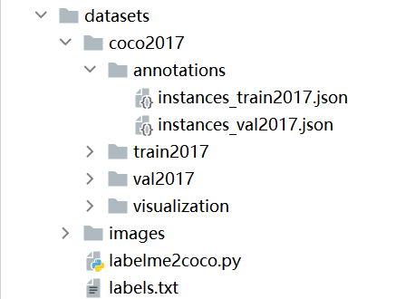

## 2.训练参数的设置

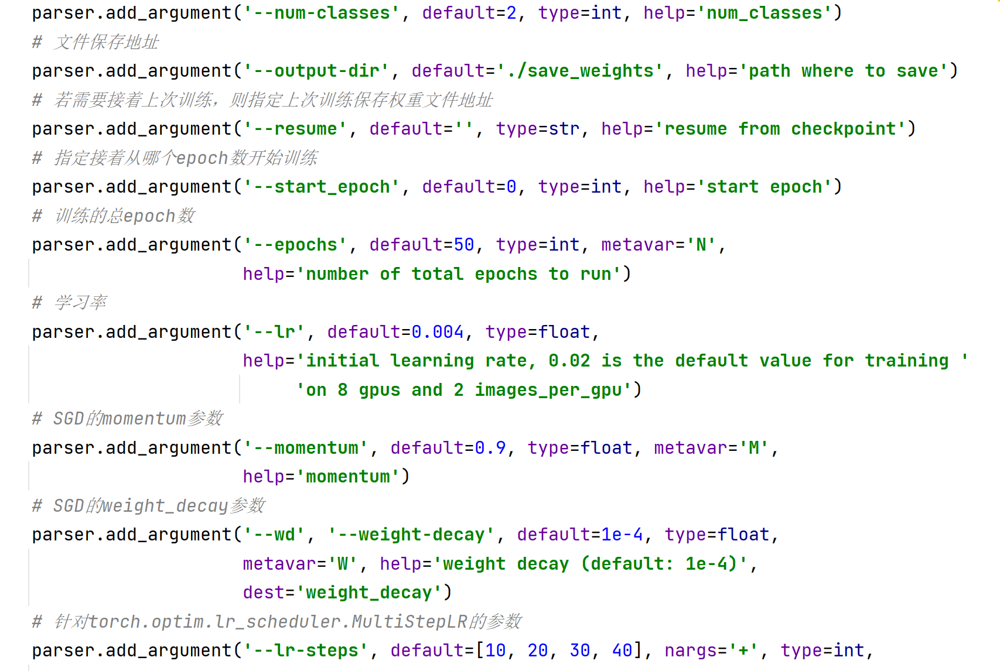

## 3.训练结果（110张，train:val = 9:1, epoch=50, lr=0.004）

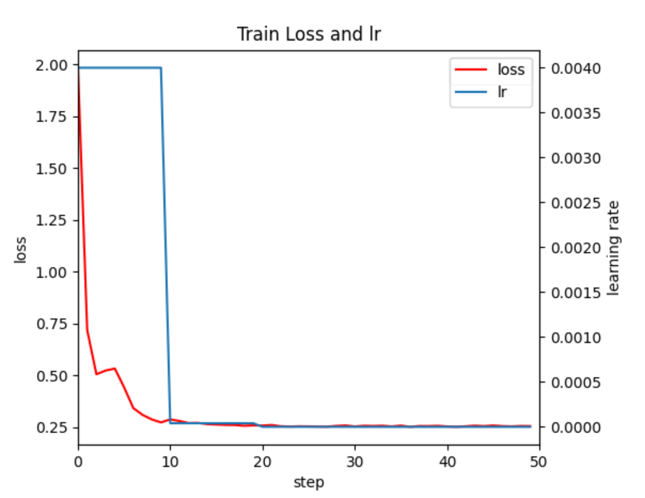

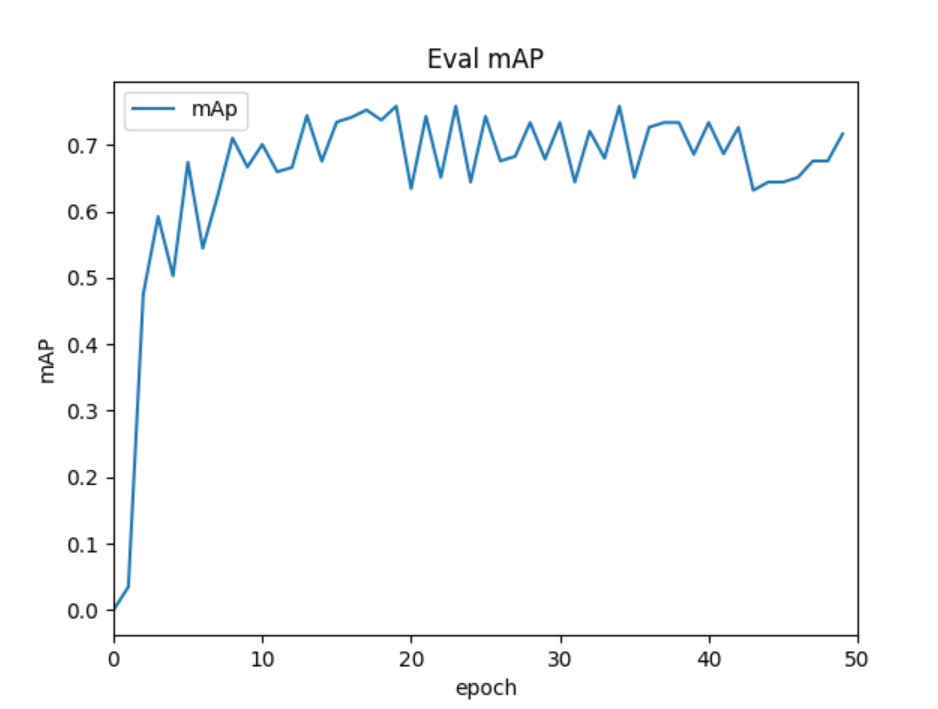

## data = 210张，train:val = 9:1  epoch = 50  lr=0.004  batchsize=4

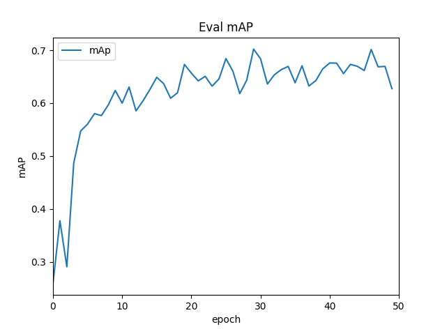

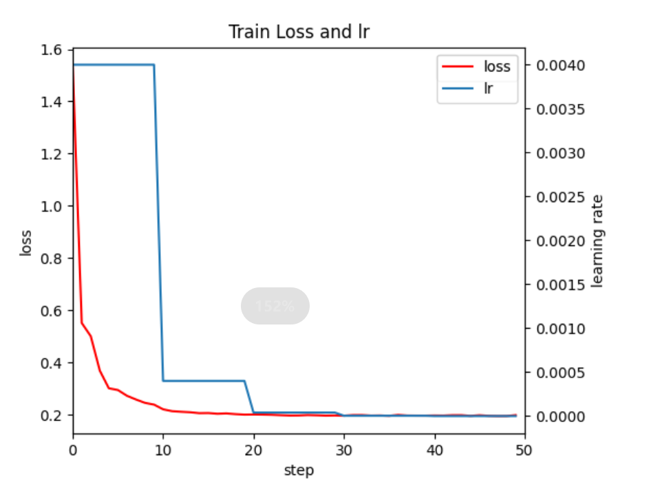

## data = 210张，train:val = 9:1  epoch = 100  lr=0.004  batchsize=4

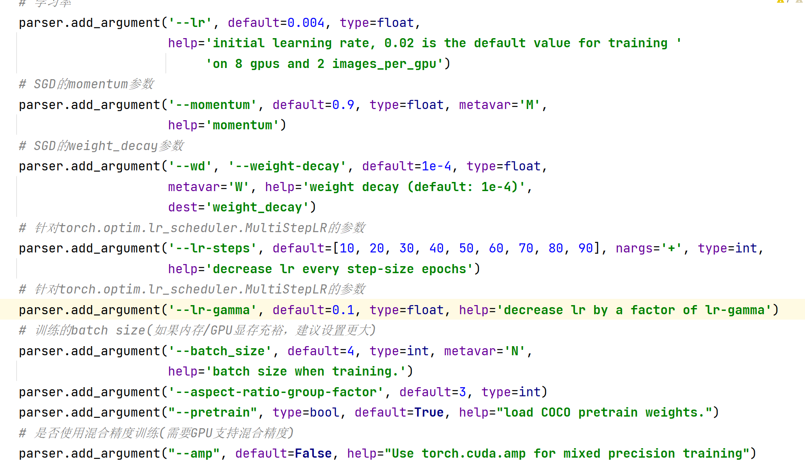

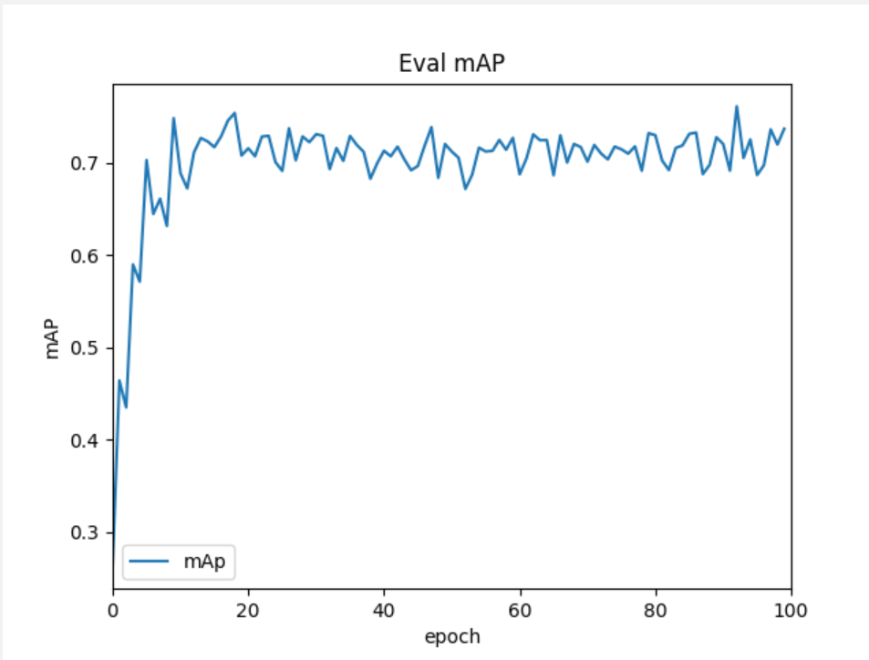

### predict结果（0011.jpg）

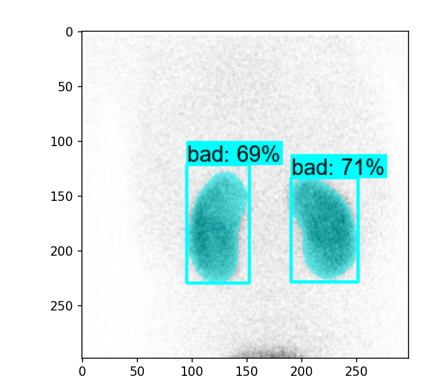

### GrounTruth

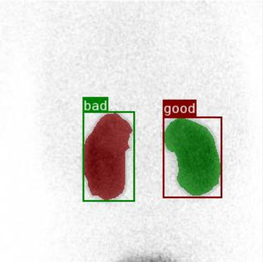

### 训练结果含义

**AP（查准率） AR(查全率)**

1. 1. Average Precision  (AP) @[ IoU=0.50:0.95 | area=   all | maxDets=100 ] = 0.499    mAP**coco**数据集评价指标
   2.  Average Precision  (AP) @[ IoU=0.50      | area=   all | maxDets=100 ] = 0.618        **VOC**数据集评价指标
   3.  Average Precision  (AP) @[ IoU=0.75      | area=   all | maxDets=100 ] = 0.575     **IOU>0.75时的查准率**
   4.  Average Precision  (AP) @[ IoU=0.50:0.95 | area= small | maxDets=100 ] = -1.000
   5.  Average Precision  (AP) @[ IoU=0.50:0.95 | area=medium | maxDets=100 ] = 0.499
   6.  Average Precision  (AP) @[ IoU=0.50:0.95 | area= large | maxDets=100 ] = -1.000
2. 1.  Average Recall     (AR) @[ IoU=0.50:0.95 | area=   all | maxDets=  1 ] = 0.416
   2.  Average Recall     (AR) @[ IoU=0.50:0.95 | area=   all | maxDets= 10 ] = 0.836   **项目中待检测类数为10的查全率**
   3.  Average Recall     (AR) @[ IoU=0.50:0.95 | area=   all | maxDets=100 ] = 0.836    **项目中待检测个数为100时的查全率**
   4.  Average Recall     (AR) @[ IoU=0.50:0.95 | area= small | maxDets=100 ] = -1.000
   5.  Average Recall     (AR) @[ IoU=0.50:0.95 | area=medium | maxDets=100 ] = 0.836
   6.  Average Recall     (AR) @[ IoU=0.50:0.95 | area= large | maxDets=100 ] = -1.000

正常肾数据集比例增加，因为网络对于好的肾脏学习不好，对坏的学习还可以，原因是因为数据集好坏比例完全不一样，坏的很多很多，好的很少。

有几种改进方法：1.直接暴力复制好肾的数据

2.使用仿体进行仿真好的数据集

**主要是实现好的数据集的问题！!**

# 11.24-12.1日

## 1.只调整mask R-CNN 

### 	1.mask_roi_pool resize (32*32) epoch=50  batch_size=2

```python
if mask_roi_pool is None:
    mask_roi_pool = MultiScaleRoIAlign(featmap_names=["0", "1", "2", "3"], output_size=32, sampling_ratio=2)
```

结果如下图：

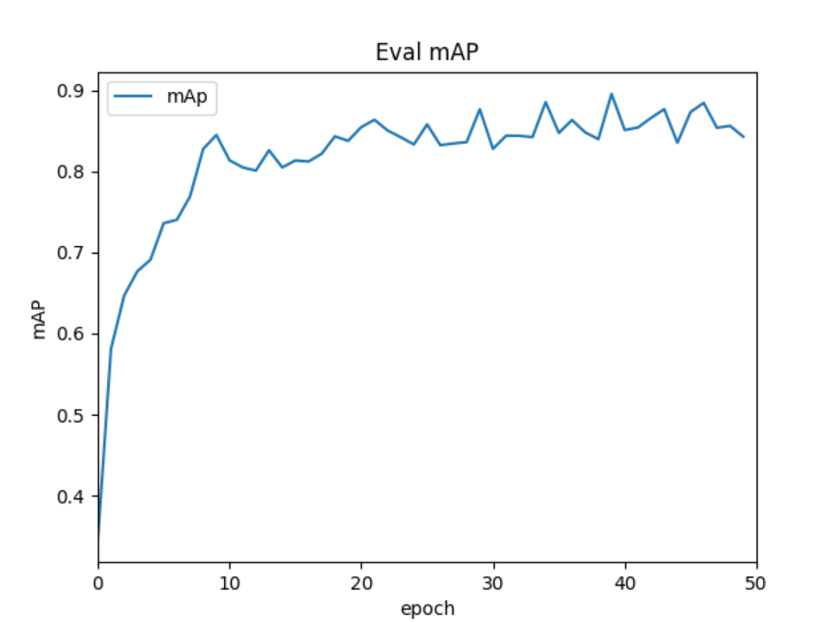

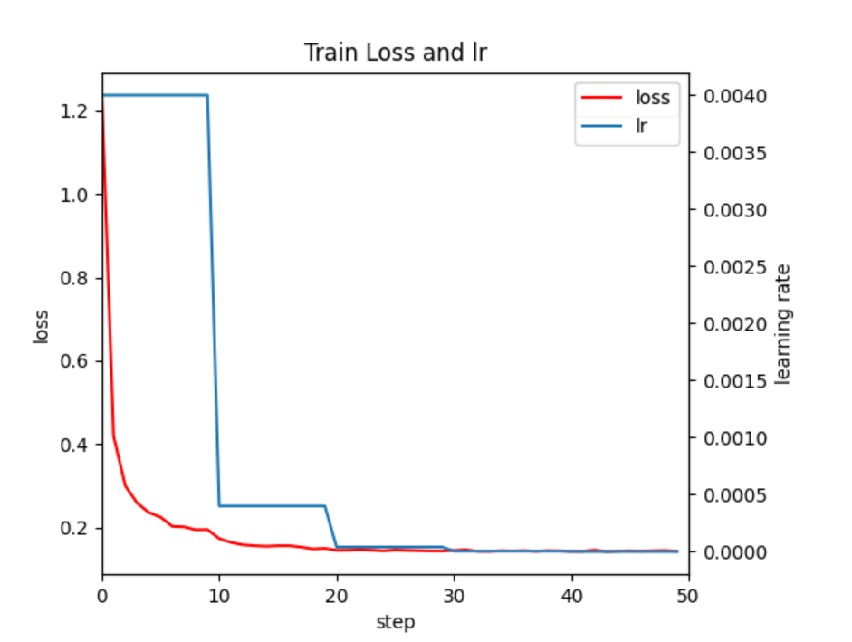

### **bestmAP：0.8956**

### 	2.mask_roi_pool resize (28*28) epoch=50  batch_size=2

```
if mask_roi_pool is None:
    mask_roi_pool = MultiScaleRoIAlign(featmap_names=["0", "1", "2", "3"], output_size=28, sampling_ratio=2)
```

结果如下：

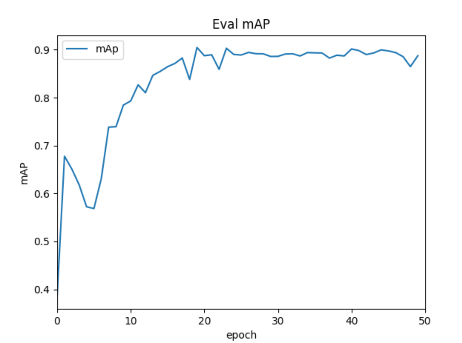

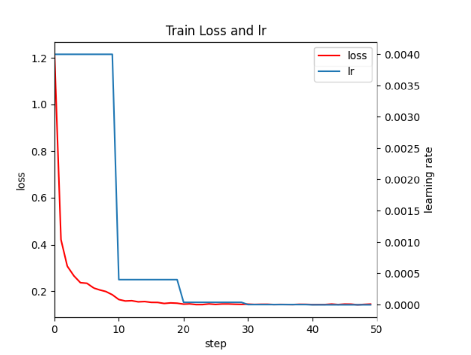
### 	（3.注：第二次跑结果如下：28*28  batch_size=2 epoch=50 
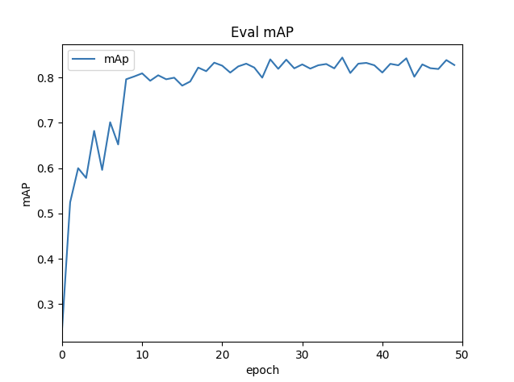
### **best_mAP：0.9047**

## 2.使用数据集增强后：

### 	分别将good-good的6张图像中进行增强，左右翻转，上下翻转，逆时针转90°，180°，270°，增强后的好的数据集为30张。datasets=240, train:test=9:1

### 	1.mask_roi_pool resize (28*28) epoch=50  batch_size=2

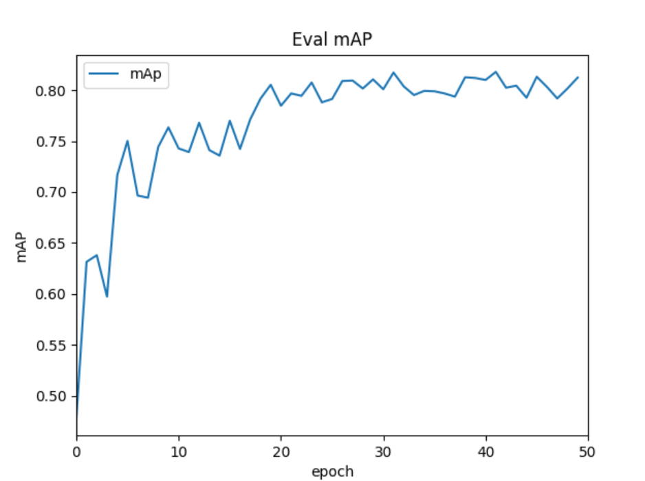
### best_mAP(Average Precision  (AP) @[ IoU=0.50      | area=   all | maxDets=100 ])是0.8132

###      第二次训练结果：
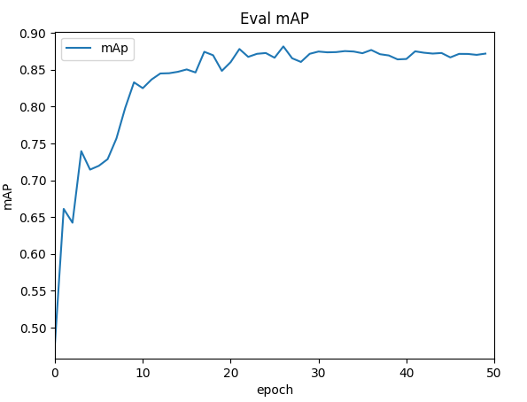
###      mAP为0.8819，故使用第二次的权重文件进行预测


### 	2.mask_roi_pool resize (32*32) epoch=50  batch_size=2
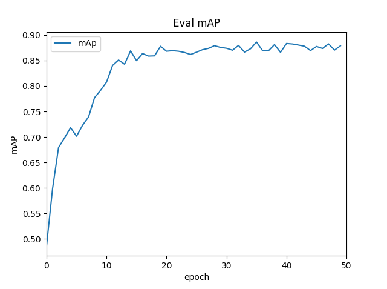
### mAP为0.8862

###     3.mask_roi_pool resize (64*64) epoch=50  batch_size=2
